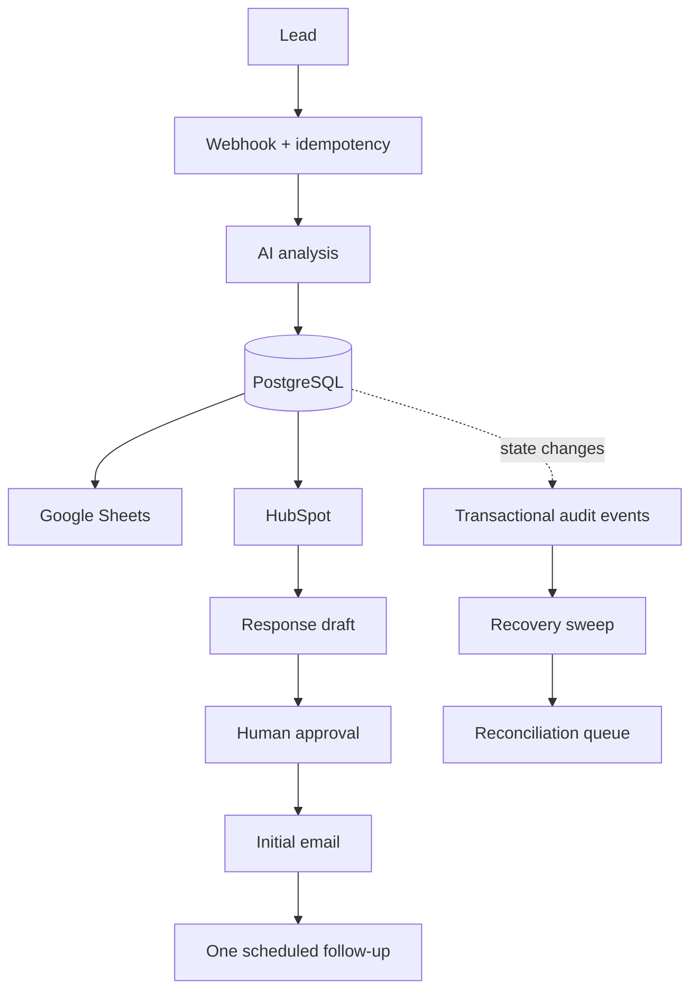

# FlowPilot

Reliable AI-assisted lead automation with human approval, idempotency,
partial-failure recovery, and operational reconciliation.

FlowPilot combines FastAPI, PostgreSQL 17, and n8n 2.37.10. It validates and
analyzes inbound leads, records durable state, coordinates CRM and spreadsheet
integrations, creates response drafts, requires explicit human approval before
lead email, and quarantines work whose external outcome cannot be proved.

## Why FlowPilot exists

Real automation fails between steps: duplicate requests race, processes stop
after external side effects, and an SMTP connection can disappear after a
server accepts a message. FlowPilot makes those boundaries visible and
recoverable. It does not claim exactly-once distributed delivery; uncertain
outcomes are held for investigation rather than replayed blindly.

## Architecture



The supported local stack starts PostgreSQL, applies migrations 001 through
008, starts the API, and then starts n8n. The OCI pilot design adds Caddy as the
only public edge while keeping PostgreSQL internal and the API and n8n editor on
loopback-only host bindings.

## Docker quickstart

Docker is the only host runtime prerequisite.

```powershell
git clone https://github.com/sudhar-shan01/flowpilot.git
cd flowpilot
Copy-Item .env.example .env
# Set POSTGRES_PASSWORD and N8N_ENCRYPTION_KEY in .env.
docker compose up --build
```

For bash or zsh, use `cp .env.example .env`. Keep `.env` untracked. Once the
containers are healthy:

- API: <http://localhost:8000>
- Swagger: <http://localhost:8000/docs>
- Health: <http://localhost:8000/health>
- n8n: <http://localhost:5678>

On first n8n startup, create the local owner account and import the four JSON
files from `n8n/`. Workflow import and credential selection are intentionally
manual. Stop without deleting named-volume state with `docker compose down`.

## Current capabilities

- Validated AI lead analysis with structured categories, priorities, scores,
  summaries, and recommended actions.
- n8n webhook intake and priority routing without duplicated AI logic.
- PostgreSQL persistence plus Google Sheets and HubSpot synchronization.
- Persisted response drafts, expiring single-use human approval, and email sent
  only from stored database values after atomic authorization.
- One deterministic follow-up scheduled 72 hours after a recorded successful
  initial response.
- Atomic idempotency, duplicate protection, delivery claims, conservative
  uncertain-send handling, and partial-work reconciliation.
- Transactional reliability events, recovery-run history, privacy-safe
  operational views, Docker packaging, and OCI single-VM pilot guidance.

External AI, Google Sheets, HubSpot, and SMTP operations require owner-supplied
credentials. The repository does not provision cloud resources or claim live
provider validation.

## Reliability and safety principles

- Optional idempotency keys are claimed atomically before business side effects.
- Matching completed requests replay only allowlisted public responses.
- Approval-link GET requests are side-effect-free; explicit POST confirmation
  performs the guarded decision.
- Initial and follow-up email sends use atomic delivery claims.
- Ambiguous SMTP outcomes become `uncertain` and are not resent automatically.
- Recovery sweeps change only states whose safe transition is known.
- Operational surfaces exclude messages, drafts, tokens, credentials, and
  plaintext idempotency keys.
- Production Caddy exposes only explicitly allowlisted public routes.

## Documentation

- [Detailed phase and operations reference](docs/PHASES.md)
- [End-to-end certification and known limitations](docs/e2e-certification.md)
- [Five-minute product and reliability demo](docs/demo.md)
- [Reliability incident runbook](docs/reliability-runbook.md)
- [OCI single-VM pilot deployment](docs/oci-deployment.md)
- [Deployment threat assessment](docs/deployment-threat-model.md)
- [Dependency and container maintenance](docs/MAINTENANCE.md)
- [Development history](docs/development-history.md)
- [Phase changelog](docs/CHANGELOG.md)

## Development

The direct dependency versions are exact in `requirements.txt`; complete
runtime and development graphs are pinned in `requirements.runtime.lock` and
`requirements.dev.lock`. Create a Python 3.11 environment with the certified
development set and run the default suite:

```powershell
python -m venv .venv
.\.venv\Scripts\python.exe -m pip install --no-deps -r requirements.dev.lock
.\.venv\Scripts\python.exe -m pip check
.\.venv\Scripts\python.exe -m pytest -q
```

Dependency and image updates belong in dedicated reviewed changes. See the
[phase reference](docs/PHASES.md#reproducible-development) for regeneration and
PostgreSQL integration-test instructions.

## Roadmap

- **Phases 1–8C complete:** lead analysis through reliability observability.
- **Phase 9 complete:** containerized deployment and reproducible packaging.
- **Phase 10A complete:** OCI pilot deployment readiness and ingress security.
- **Live provisioning pending owner approval:** no OCI resources are created by
  this repository.

See the [phase changelog](docs/CHANGELOG.md) for verified dates and pull
requests, and [the detailed phase reference](docs/PHASES.md) for the complete
capability history.

## License

FlowPilot is available under the [MIT License](LICENSE).
